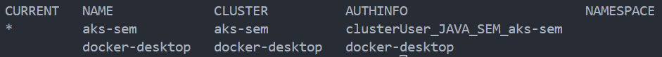
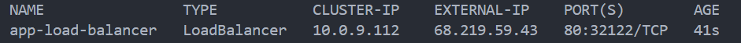
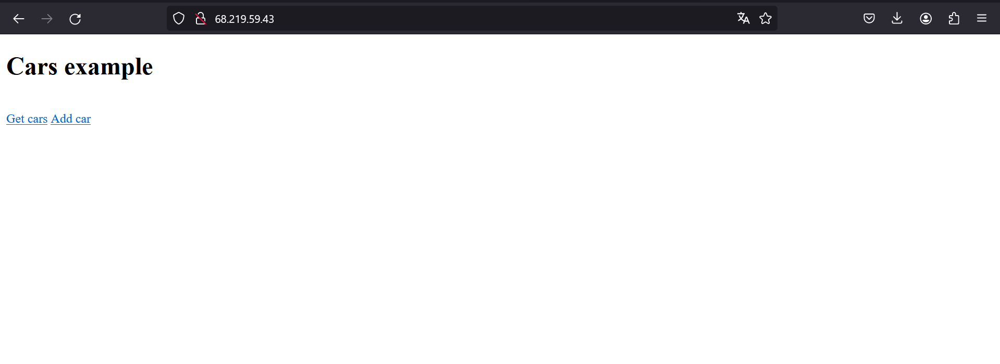

# SEM-AKS instructions

## SSH key

In order to run this example, first you need to create the SSH key.

```powershell
az sshkey create --name "<NAME_OF_THE_KEY>" --resource-group "<NAME_OF_THE_RESOURCE_GROUP>"
```

## Deploying infrastructure

Then, you have to execute the following command:

```powershell
az deployment group create --resource-group <NAME_OF_THE_RESOURCE_GROUP> --template-file .\bicep\deploy.bicep  --parameters .\bicep\params.json --parameters linuxAdminUsername=<NAME_OF_THE_ADMIN_USER> sshRSAPublicKey='<YOUR_SSH_KEY>'
```

**IMPORTANT!** - in order for everything to work, the `resource group` parameters values have to match between the one used to generate SSH key and the one used for deploying your infrastructure.

## Adding AKS as the K8s context

After you have executed the deployment command, assuming it ended with no error, the next step includes adding new context so that you can create new Kubernetes objects remotely. In order to achieve that, please execute the following command:

```powershell
az aks get-credentials --resource-group <NAME_OF_THE_RESOURCE_GROUP> --name <NAME_OF_THE_CLUSTER>
```

You may want to check whether the context is currently set to the AKS, so to achieve that, execute:

```powershell
kubectl config get-contexts
```

The output may look like this:


## Creating app resources

Next steps include applying yaml files so that the new objects will be created.
**IMPORTANT!** - in order for the current `deployment.yaml` files to work properly, you have to create [ConfigMaps](https://kubernetes.io/docs/concepts/configuration/configmap/) which will include keys specified in the `env` sections for the app and PostgreSQL database deployments.
Once you have created all necessary ConfigMaps. The only missing step is to apply yaml files.
Consider running following instruction for each individual file:

```powershell
kubectl apply -f .\deployment.yaml
```

## Accessing the web app

To reach your recently deployed web application, you have to grab public IP address associated with it.
The next instruction shows exactly that:

```powershell
kubectl get svc
```

The output may look similar to this:

Grab the `EXTERNAL-IP` and paste it to the browser.
And _cars example website_ is running!

