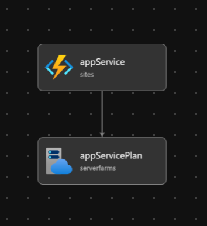

# SEM-DOCKER instructions

## Infastructure provisioning

In order to create required resources at Azure, the following instruction is needed:

```powershell
az deployment group create --resource-group JAVA_SEM --template-file .\bicep\deploy.bicep
```

The result of this command should be as follows:


App code can be deployed using different means like extensions in your favorite IDE.

At the end, you should see the following outcome:

